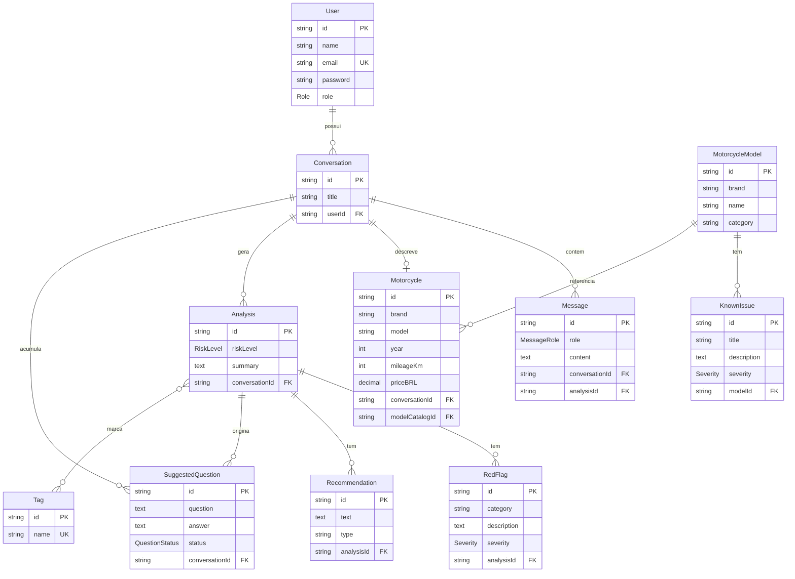

# MotoCheck AI
#### Sistema inteligente de análise de anúncios e auxílio na compra de motocicletas usadas

**Autor:** Pedro Gouveia

Este artigo documenta o projeto final da unidade curricular Projeto de Desenvolvimento II do curso de Análise e Desenvolvimento de Sistemas do Centro Universitário Senac-RS.

-----

## Resumo do Projeto

A compra de motocicletas usadas, sobretudo de modelos de entrada (como Honda CG 160 Fan e Yamaha Factor 150), expõe compradores leigos a riscos financeiros e mecânicos, pois anúncios online frequentemente omitem defeitos, histórico de manutenção e pendências documentais. Esse problema é relevante porque o comprador, sem conhecimento técnico, não consegue interpretar as "entrelinhas" de um anúncio nem sabe o que perguntar ao vendedor, o que leva a perda de tempo e prejuízo. O MotoCheck AI é uma aplicação web com um **agente de inteligência artificial especializado em motos usadas**, que interpreta o texto do anúncio, classifica o risco da compra, aponta sinais de alerta e sugere perguntas estratégicas ao vendedor, mantendo memória da conversa. Como consequência, o comprador passa a negociar com mais segurança e informação, reduzindo as chances de um mau negócio.

## Definição do Problema

O mercado brasileiro de motocicletas usadas é expressivo e movimenta majoritariamente modelos populares de baixa cilindrada, usados como meio de transporte e de trabalho (entrega/delivery). A negociação costuma ocorrer entre particulares, em plataformas de classificados, onde o anúncio é a principal — muitas vezes a única — fonte de informação antes da visita presencial.

O comprador leigo enfrenta dificuldades como:
- **Interpretação técnica:** termos como "motor retificado", "moto de repasse", "documento atrasado" ou "no estado" indicam riscos que o leigo não reconhece.
- **Assimetria de informação:** o vendedor conhece o histórico da moto; o comprador não, e lhe faltam as perguntas certas a fazer.
- **Pendências ocultas:** débitos de IPVA/multas, restrição/gravame, procedência de leilão ou sinistro nem sempre aparecem no anúncio.
- **Falta de apoio especializado:** ferramentas genéricas (IAs de conversação comuns) não têm foco no domínio de motos usadas, e sites de classificados não orientam o comprador.

A ausência de uma ferramenta acessível que oriente o comprador leigo exatamente nesse momento — a leitura do anúncio e a preparação para a negociação — é a lacuna que este projeto endereça. O comparativo com soluções existentes é apresentado na seção *Arquitetura* (Benchmarking).

## Objetivos

**Objetivo geral:** desenvolver uma aplicação web com um agente de IA especializado que auxilie compradores leigos a avaliar anúncios de motocicletas usadas, aumentando a segurança e a confiança na negociação.

**Objetivos específicos:**
- Permitir o cadastro/login de usuários e o registro de múltiplas conversas de análise.
- Interpretar o texto de um anúncio e extrair dados estruturados da moto (marca, modelo, ano, km, preço, localização).
- Classificar o risco da compra (baixo, médio, alto) e apontar sinais de alerta (*red flags*).
- Sugerir perguntas objetivas para o usuário fazer ao vendedor e registrar as respostas, mantendo memória da conversa.
- Fundamentar as análises em uma base de conhecimento de problemas conhecidos por modelo (técnica de RAG), expansível ao longo do tempo.
- Garantir segurança (autenticação, validação de dados) e uma interface agradável e responsiva.

## Stack Tecnológico

- **Next.js (App Router) + React + TypeScript** — framework do frontend, escolhido pela renderização híbrida (Server/Client Components), roteamento moderno e *Route Handlers*, que permitiram implementar um proxy seguro para o backend.
- **Tailwind CSS** — estilização utilitária, acelera a construção de uma UI consistente e responsiva.
- **NestJS + TypeScript** — framework do backend, escolhido por sua arquitetura modular, injeção de dependência e bom suporte a Clean Architecture/DDD, favorecendo organização e testabilidade.
- **Prisma ORM + PostgreSQL (Supabase)** — ORM tipado e banco relacional na nuvem. O modelo relacional rico (conversas, mensagens, análises, catálogo) justifica o uso de um banco SQL.
- **Autenticação JWT** (`@nestjs/jwt` + Passport) — autenticação stateless por token, com *guard* global e rotas públicas marcadas explicitamente (*secure by default*).
- **Inteligência Artificial — Google Gemini:** o acesso ao modelo é isolado por uma interface `ILLMProvider`, com implementação para o **Google Gemini** (`@google/generative-ai`). A saída é forçada a JSON estruturado (`responseMimeType`) e normalizada antes de ser persistida. A especialização do agente vem de *prompt* + RAG, sem *fine-tuning*.
- **Deploy:** **Vercel** (frontend) e **Render** (backend), com banco no **Supabase** — integração contínua via Git (push → deploy automático).

### Uso de Inteligência Artificial no Desenvolvimento

Além do Google Gemini — que é a IA que compõe o próprio produto, como descrito ao longo deste documento —, foram utilizadas ferramentas de IA generativa como apoio ao processo de desenvolvimento: assistentes de codificação baseados em LLM, usados para geração e revisão de trechos de código, sugestões de refatoração e aceleração da implementação de decisões já definidas. As decisões de arquitetura, a modelagem de domínio, a escolha de tecnologias, a especificação dos requisitos e os critérios de segurança e performance foram definidos pelo autor, que também revisou, testou e ajustou cada funcionalidade entregue. O uso de assistentes de IA no fluxo de desenvolvimento é uma prática cada vez mais comum na engenharia de software profissional, análoga ao uso de outras ferramentas de produtividade (autocomplete, linters, geradores de scaffolding).

## Descrição da Solução

O MotoCheck AI é uma aplicação web no formato de **chat conversacional**, semelhante a assistentes de IA populares, porém com um diferencial: o agente é **especializado em motos usadas**. O usuário cria uma conta e inicia uma ou mais conversas; em cada conversa, cola o texto de um anúncio e dialoga com o agente.

Ao receber um anúncio, o agente interpreta o texto e produz uma **análise estruturada**: classifica o risco da compra (baixo, médio ou alto), lista os **sinais de alerta** identificados (com categoria e severidade), apresenta **recomendações** de vistoria e negociação, e sugere **perguntas objetivas** para o usuário fazer ao vendedor. O usuário pode trazer de volta as respostas do vendedor, que passam a integrar a **memória da conversa** — o agente as considera para refinar a análise nas mensagens seguintes, sem repetir perguntas já respondidas.

A "especialização" do agente combina três mecanismos: (1) um *prompt* de sistema que define seu papel e regras de saída; (2) uma **base de conhecimento** (catálogo de modelos e seus problemas conhecidos) que o agente consulta e injeta no contexto — técnica conhecida como *Retrieval-Augmented Generation* (RAG); e (3) a memória por conversa. Não há treinamento/*fine-tuning* de modelo — a inteligência vem de engenharia de *prompt* e recuperação de conhecimento, o que torna o sistema barato e fácil de evoluir (basta enriquecer o catálogo).

Em termos de **segurança**, todas as rotas do backend são protegidas por autenticação por padrão (JWT), exceto as explicitamente públicas (login, cadastro e leitura do catálogo); cada usuário só acessa suas próprias conversas; e todas as entradas passam por **validação**. No frontend, o token de sessão fica em um *cookie httpOnly* e o navegador conversa apenas com o próprio servidor Next (que faz proxy ao backend), evitando exposição do token e problemas de CORS.

A interface é composta por uma tela de **login/cadastro**, um **menu lateral** com a lista de conversas (criar, renomear, excluir), a **área de chat** (mensagens do usuário e do agente) e um **painel de análise** fixo, que exibe os dados da moto, o nível de risco, os sinais de alerta, as recomendações e as perguntas ao vendedor.

### Soluções de Segurança

A segurança foi tratada como requisito transversal, aplicada em várias camadas (*defense in depth*). As soluções efetivamente implementadas são:

1. **Hash de senha com bcrypt (nunca em texto puro).** As senhas são cifradas com `bcrypt` (fator de custo 10) no cadastro e comparadas com `bcrypt.compare` no login. O banco jamais armazena a senha original; um vazamento do banco não expõe as credenciais. *Implementação:* `CreateUserUseCase` e `LoginUseCase`.
2. **Autenticação stateless por JWT com *guard* global (*secure by default*).** Todas as rotas do backend exigem token por padrão; apenas as marcadas explicitamente com `@Public()` (login, cadastro e leitura do catálogo) ficam abertas. Isso impede que uma rota nova seja exposta por esquecimento. *Implementação:* `JwtAuthGuard` registrado como `APP_GUARD` global + decorator `@Public()`.
3. **Token em *cookie httpOnly* + *proxy* servidor-a-servidor.** O JWT é gravado em um cookie `httpOnly` (inacessível ao JavaScript do navegador, mitigando roubo de token por **XSS**) com `sameSite: lax` (mitiga **CSRF**) e flag `secure` em produção (trafega só sobre HTTPS). O navegador nunca fala diretamente com o backend: conversa apenas com o próprio servidor Next, que atua como *proxy* e anexa o token no lado do servidor. Além de proteger o token, isso elimina a exposição de CORS no cliente. *Implementação:* `lib/authCookie.ts` e `app/api/backend/[...path]/route.ts`.
4. **Validação e sanitização de toda entrada (*ValidationPipe* global + DTOs).** Todo dado que entra na API passa por um `ValidationPipe` global com `class-validator` (ex.: `@IsEmail`, `@MinLength`, `@MaxLength`), rejeitando payloads malformados antes de chegar à lógica de negócio e reduzindo a superfície para injeção e dados inconsistentes. *Implementação:* `main.ts` (pipe global) + DTOs por caso de uso.
5. **Proteção contra SQL Injection via ORM parametrizado.** O acesso ao banco é feito exclusivamente pelo Prisma, que gera *prepared statements* parametrizados — não há concatenação de SQL com entrada do usuário.
6. **Isolamento de dados por usuário (autorização).** Cada usuário só acessa suas próprias conversas: as consultas filtram pelo `userId` extraído do token, impedindo acesso horizontal a dados de terceiros (*IDOR*).
7. **Gestão de segredos por variáveis de ambiente.** Chaves (`JWT_SECRET`, credenciais de banco, chaves de API de IA) ficam em variáveis de ambiente fora do versionamento (`.gitignore`), com um `.env.example` documentando o formato sem expor valores. CORS é restrito à origem do frontend (`CORS_ORIGIN`).

### Soluções de Performance

1. **RAG seletivo (recuperação sob demanda).** Em vez de injetar todo o catálogo de conhecimento no *prompt*, o método `findRelevant` recupera apenas os modelos pertinentes à moto mencionada no anúncio. Isso reduz o número de *tokens* enviados ao LLM — diminuindo latência e custo por análise — e mantém o desempenho estável mesmo conforme o catálogo cresce.
2. **Janela de contexto limitada.** O contexto enviado ao modelo usa apenas as últimas mensagens da conversa (janela deslizante), evitando o crescimento ilimitado do *payload* e mantendo latência e custo por requisição sob controle mesmo em conversas longas.
3. **Persistência do turno em transação única.** A gravação da resposta do agente (mensagem + análise + *red flags* + recomendações + perguntas) ocorre em uma única transação do Prisma (`saveAgentTurn`), reduzindo *round-trips* ao banco e garantindo atomicidade.
4. **Renderização no servidor e navegação client-side.** O uso de *Server Components*/SSR no carregamento inicial reduz o trabalho no cliente, enquanto a navegação subsequente é *client-side* (sem *reloads*), tornando a interface mais responsiva (ver *Modelo de Renderização*).

## Arquitetura

O sistema segue uma arquitetura em camadas. O **frontend** (Next.js) cuida da interface e de um proxy seguro; o **backend** (NestJS) concentra a lógica de negócio em módulos seguindo Clean Architecture/DDD (entidades → repositórios → casos de uso → controladores); a **persistência** usa Prisma sobre PostgreSQL (Supabase); e a **IA** é acessada por uma camada abstrata (`ILLMProvider`) que conversa com o Google Gemini.

**Fluxo de uma análise:** o usuário envia uma mensagem → o backend persiste a mensagem, monta o contexto (histórico + dados da moto + última análise + perguntas + conhecimento do catálogo) → chama o LLM exigindo saída estruturada → persiste a resposta, a análise e as perguntas → o frontend exibe o resultado.

Repositório do projeto: https://github.com/opedrogouveia/motocheck-ai

### Modelo de Renderização

O frontend adota o modelo **híbrido** do Next.js (App Router), combinando renderização no servidor e no cliente conforme a necessidade de cada tela:

- **Server Components / SSR** são usados onde a renderização no servidor traz ganho de segurança ou desempenho. O caso mais importante é o *layout* protegido do chat, um *Server Component* que lê o *cookie* de sessão e redireciona para o login **antes** de qualquer conteúdo chegar ao navegador — a verificação de acesso não depende de JavaScript no cliente. Os *Route Handlers* do Next (o *proxy* para o backend) também executam no servidor, mantendo o token fora do alcance do navegador.
- **Client Components** (`"use client"`) são usados nas partes interativas — formulários de login/cadastro, chat, sidebar e painel de análise — que dependem de estado e eventos do usuário (`useState`, `useContext`, `useEffect`).
- **Navegação *client-side* (comportamento de SPA):** após o carregamento inicial, a troca de telas (ex.: abrir uma conversa em `/c/[id]`) e a atualização da interface ocorrem no próprio navegador, sem recarregar a página, consumindo a API REST de forma assíncrona via `fetch`.

Essa escolha entrega o melhor dos dois modelos: a proteção de rotas e o *proxy* seguro no servidor, e a fluidez de uma *Single Page Application* na interação. A justificativa central é que a **decisão de segurança** (token nunca no cliente) e a **experiência de uso** (interface reativa, sem *reloads*) puderam coexistir graças ao modelo de renderização híbrido.

### Artefato 1 — Diagrama de Entidade-Relacionamento (ER)

*O diagrama é renderizado automaticamente no GitHub (bloco mermaid) e pode ser exportado como imagem em mermaid.live.*

### Artefato 2 — Tabela de Benchmarking (projetos correlatos)

| Característica | **MotoCheck AI** | IA genérica (ChatGPT/Gemini) | Classificados (OLX/Webmotos) | Vistoria cautelar |
|---|:---:|:---:|:---:|:---:|
| Especializado em moto usada | ✅ | ❌ | ❌ | ✅ (presencial) |
| Analisa o texto do anúncio | ✅ | ⚠️ genérico | ❌ | ❌ |
| Classifica risco da compra | ✅ | ❌ | ❌ | ⚠️ laudo |
| Sugere perguntas ao vendedor | ✅ | ⚠️ genérico | ❌ | ❌ |
| Base de conhecimento por modelo | ✅ | ❌ | ❌ | ⚠️ |
| Memória da negociação | ✅ | ⚠️ | ❌ | ❌ |
| Gratuito / acessível online | ✅ | ⚠️ | ✅ | ❌ (pago/presencial) |

### Artefato 3 — Casos de Uso (principais)

- **UC01 – Cadastrar/Autenticar:** o usuário cria conta e faz login (JWT).
- **UC02 – Gerenciar conversas:** criar, listar, renomear e excluir conversas.
- **UC03 – Analisar anúncio:** enviar o texto do anúncio e receber análise estruturada (risco, alertas, recomendações, perguntas).
- **UC04 – Registrar resposta do vendedor:** responder a uma pergunta sugerida; o agente passa a considerá-la.
- **UC05 – Continuar análise:** pedir uma reavaliação considerando as respostas obtidas.
- **UC06 – (Admin) Gerenciar catálogo:** cadastrar modelos e problemas conhecidos (base de conhecimento do agente).

### Artefato 4 — Personas

- **João, 24 anos** — vai comprar a primeira moto (CG 160 Fan) para trabalhar. Entende pouco de mecânica e tem receio de ser enganado. Quer saber o que perguntar e se o preço é justo.
- **Marcos, 31 anos** — já teve motos e quer trocar a sua. Sabe o básico, mas quer agilidade para filtrar anúncios ruins antes de perder tempo indo ver pessoalmente.

### Artefato 5 — Arquitetura em camadas e componentes reutilizados

- **Camadas:** Apresentação (Next.js) · Aplicação/Negócio (NestJS — casos de uso) · Domínio (entidades + interfaces de repositório) · Infraestrutura (Prisma/PostgreSQL, provedores de LLM).
- **Padrões reutilizados:** Repository Pattern, Injeção de Dependência, DTOs com validação, *Guard* de autenticação global e a interface `ILLMProvider` para isolar o acesso ao provedor de IA (Google Gemini).

## Validação

A validação verifica se o sistema cumpre seu objetivo: **aumentar a confiança e a informação do comprador leigo** ao avaliar um anúncio de moto usada. A abordagem combina duas frentes:
1. **Validação funcional:** testar o fluxo completo com anúncios reais coletados em classificados, conferindo se as análises (risco, alertas, perguntas) são coerentes com o conteúdo do anúncio.
2. **Validação com usuários:** apresentar a aplicação a um grupo de pessoas com o perfil das personas e coletar percepções por meio de um questionário estruturado.

## Estratégia

A validação com usuários será conduzida com um grupo de **3 a 8 participantes** com o perfil das personas (compradores leigos ou que já adquiriram moto usada). Cada participante utilizará a aplicação publicada com um anúncio real por alguns minutos e, em seguida, responderá ao questionário abaixo (escala de 1 a 5, salvo indicação), aplicado via formulário online:

1. Qual seu nível de conhecimento sobre motos? (1 nenhum – 5 especialista)
2. A análise de risco apresentada foi clara e fácil de entender?
3. Os sinais de alerta apontados fizeram sentido para o anúncio?
4. As perguntas sugeridas ao vendedor foram úteis/relevantes?
5. Você se sentiria mais seguro para negociar usando o MotoCheck AI?
6. A interface foi agradável e fácil de usar?
7. Você usaria essa ferramenta antes de comprar uma moto usada? (Sim/Não/Talvez)
8. (Aberta) O que faltou ou o que você melhoraria?

## Consolidação dos Dados Coletados

Os resultados do questionário serão consolidados em **gráficos e médias por questão** (por exemplo, média de clareza, de utilidade das perguntas e percentual de participantes que usariam a ferramenta), acompanhados de uma discussão sobre o que os números indicam quanto ao atingimento dos objetivos, os pontos fortes percebidos e as oportunidades de melhoria.

## Conclusões

O projeto entregou uma aplicação web funcional e publicada que cumpre o objetivo proposto: um agente de IA especializado que apoia o comprador leigo de motos usadas, interpretando anúncios, classificando risco, alertando para problemas e sugerindo perguntas ao vendedor. A arquitetura (Clean Architecture no backend, IA provider-agnóstica com RAG, autenticação e validação) demonstra organização técnica e foi pensada para evoluir — sobretudo pela facilidade de enriquecer a base de conhecimento sem retreinar modelos. A retomada dos objetivos à luz dos resultados da validação encerra a avaliação do trabalho.

## Limitações do Projeto e Perspectivas Futuras

**Limitações:**
- A análise depende exclusivamente do **texto** fornecido pelo usuário; não verifica fotos, documentos nem dados oficiais (Detran, tabela FIPE).
- A precisão depende da qualidade do *prompt* e da **abrangência do catálogo** de conhecimento, ainda inicial.
- Cada conversa trata de **uma única moto** (decisão de projeto para clareza).
- No plano gratuito de hospedagem, o backend pode "hibernar", causando lentidão na primeira requisição.

**Perspectivas futuras:**
- **Análise de fotos** do anúncio (IA multimodal).
- Integração com **tabela FIPE** e consulta de débitos/restrições.
- Tela de **administração do catálogo** pela interface.
- Comparação de **múltiplas motos** e exportação de relatório (PDF).
- Aplicativo móvel e refinamento contínuo do agente (mais modelos/problemas no catálogo).

## Referências Bibliográficas

NEXT.JS. **Next.js documentation**. [*S. l.*]: Vercel, 2026. Disponível em: https://nextjs.org/docs. Acesso em: 1 jul. 2026.

NESTJS. **NestJS documentation**. [*S. l.: s. n.*], 2026. Disponível em: https://docs.nestjs.com. Acesso em: 1 jul. 2026.

PRISMA. **Prisma documentation**. [*S. l.: s. n.*], 2026. Disponível em: https://www.prisma.io/docs. Acesso em: 1 jul. 2026.

POSTGRESQL GLOBAL DEVELOPMENT GROUP. **PostgreSQL documentation**. [*S. l.: s. n.*], 2026. Disponível em: https://www.postgresql.org/docs. Acesso em: 1 jul. 2026.

SUPABASE. **Supabase documentation**. [*S. l.: s. n.*], 2026. Disponível em: https://supabase.com/docs. Acesso em: 1 jul. 2026.

TAILWIND LABS. **Tailwind CSS documentation**. [*S. l.: s. n.*], 2026. Disponível em: https://tailwindcss.com/docs. Acesso em: 1 jul. 2026.

GOOGLE. **Gemini API documentation**. [*S. l.: s. n.*], 2026. Disponível em: https://ai.google.dev/docs. Acesso em: 1 jul. 2026.

LEWIS, Patrick *et al.* Retrieval-augmented generation for knowledge-intensive NLP tasks. **In**: ADVANCES IN NEURAL INFORMATION PROCESSING SYSTEMS (NeurIPS), 33., 2020. **Anais [...]**. [*S. l.: s. n.*], 2020.

WAZLAWICK, Raul Sidnei. **Metodologia de pesquisa para ciência da computação**. Rio de Janeiro: Elsevier, 2009.
